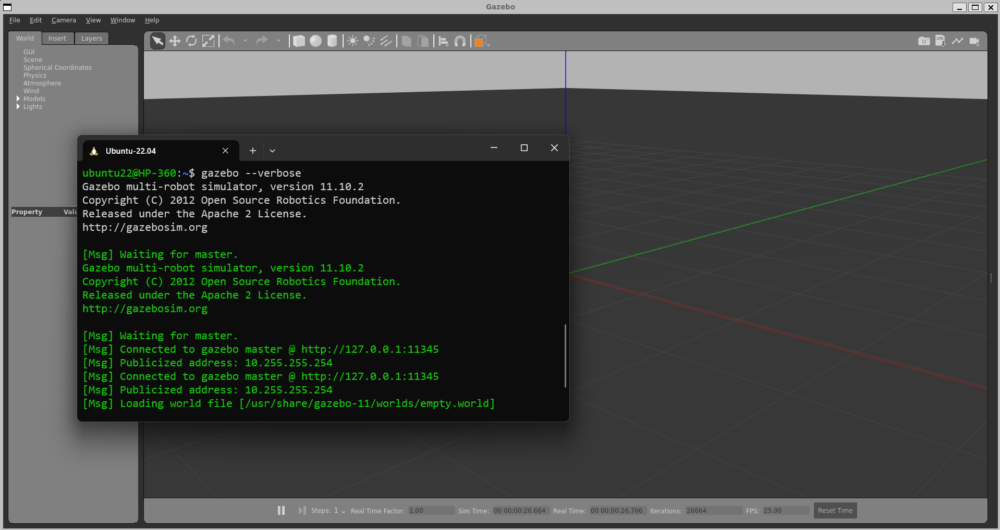
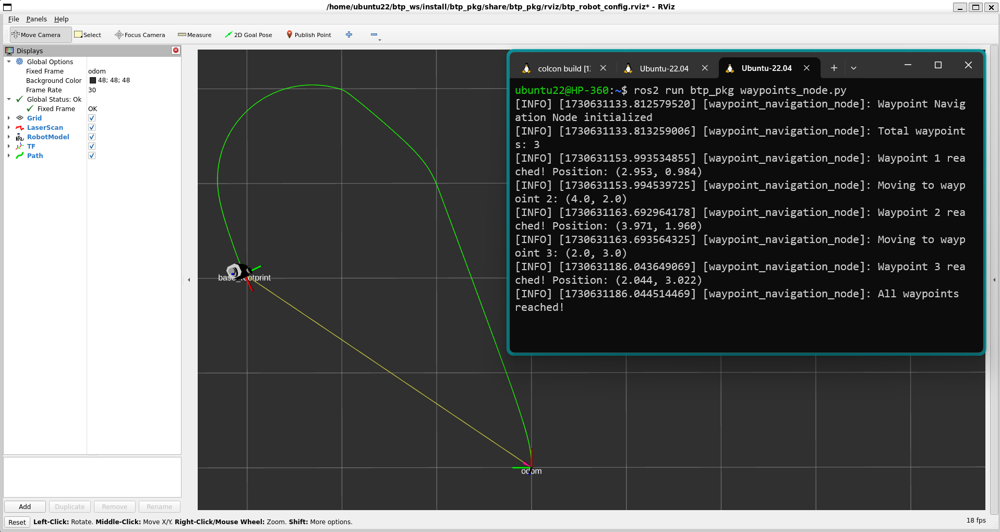

# BTP Doc
This ros2 package is the implementation of things i've done as part of my BTP under [Prof. Arnab Dey](https://www.iitr.ac.in/~EE/Arnab_Dey).    
This doc provides step by step process to setup this package & check the results on either the turtlebot3 hardware or in gazebo simulation.

## Requirements 
- Ubuntu 22.04 LTS     
- ROS2 Humble   

## Installing Pre-requisites
- Update your debian packages :
```
sudo apt update && sudo apt upgrade -y
```
- Install ROS2 Humble from here (if not installed already) [`ROS2 Doc`](https://docs.ros.org/en/humble/Installation/Ubuntu-Install-Debs.html).   
Source the ROS2 environment using this command :  
```
echo 'source /opt/ros/humble/setup.bash' >> ~/.bashrc
```
- Install gazebo11-classic to simulate your work & other turtlebot3 dependencies :
```
sudo apt install gazebo
sudo apt install ros-humble-gazebo-*
sudo apt install ros-humble-cartographer
sudo apt install ros-humble-cartographer-ros
sudo apt install ros-humble-tf-transformations
sudo apt install ros-humble-navigation2
sudo apt install ros-humble-nav2-bringup
sudo apt install ros-humble-dynamixel-sdk
```

Source your gazebo11 environment    
```
echo "source /usr/share/gazebo/setup.sh" >> ~/.bashrc
source ~/.bashrc
```

Run gazebo to see if everything is working    
```
gazebo --verbose
```
It should open the following window
<div align="center">
  
</div> 

## Setting up the project 
- Create a ros2 workspace for this project :
```
cd ~
mkdir -p btp_ws/src
cd btp_ws/src
git clone -b humble-devel https://github.com/ROBOTIS-GIT/turtlebot3_simulations.git
git clone -b humble-devel https://github.com/ROBOTIS-GIT/turtlebot3_msgs.git
git clone -b humble-devel https://github.com/ROBOTIS-GIT/turtlebot3.git
git clone https://github.com/ab31mohit/btp_pkg.git
cd ~/btp_ws/
colcon build
echo "source ~/btp_ws/install/setup.bash" >> ~/.bashrc
```
Make sure all the above clones packagesa and sub packages are built without any errors.   
Also do export the turtlebot3 model environment variable to specify which model of turtlebot3 should be used by gazebo to simulate the environment.
You can choose any of `burger` or `waffle_pi`. I chose `burger` for now :
```
echo "export TURTLEBOT3_MODEL=burger" >> ~/.bashrc
```
## Using the package :

### 1. Simulating multiple goal waypoints in gazebo :  
- Launch the gazebo world   
```
ros2 launch turtlebot3_gazebo empty_world.launch.py
```
- Launch the rviz in a new terminal
```
ros2 launch btp_pkg rviz.launch.py
```
- Run the waypoints node in a new terminal
```
ros2 run btp_pkg waypoints_node.py
```
The default waypoints are as follows :   
`[ (3.0, 1.0), (4.0, 2.0), (2.0, 3.0) ]`   

We can change the number of waypoints and their values but there is still some need of improvement to consider all cases.   

The output should be something like this : 
<div align="center">
  
</div> 